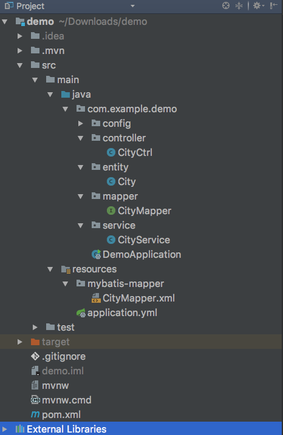

# Data层

> 一开始的时候，是使用了一段时间JPA，感觉到后面业务复杂的时候，不够灵活。
>
> 后来尝试了Mybits，感觉很棒，非常灵活和使用，而且还有现成的分页插件可以使用。
>
> 虽然需要自己手写一些sql，但是自己写的sql，用着安心。有问题也知道去哪里找。

## mybatis的基本使用

### 准备数据库

a.创建数据库

```sql
CREATE DATABASE spring-boot-memo;
```

b.创建表

```sql
DROP TABLE IF EXISTS  `city`;
CREATE TABLE `city` (
  `id` int(10) unsigned NOT NULL AUTO_INCREMENT COMMENT '城市编号',
  `province_id` int(10) unsigned  NOT NULL COMMENT '省份编号',
  `city_name` varchar(25) DEFAULT NULL COMMENT '城市名称',
  `description` varchar(25) DEFAULT NULL COMMENT '描述',
  PRIMARY KEY (`id`)
) ENGINE=InnoDB AUTO_INCREMENT=1 DEFAULT CHARSET=utf8;
```

c.插入数据

```sql
INSERT city VALUES (1 ,1,'温岭市','BYSocket 的家在温岭。');

```

### 添加依赖

pom.xml
```
<dependency>
    <groupId>mysql</groupId>
    <artifactId>mysql-connector-java</artifactId>
    <version>5.1.21</version>
</dependency>
<dependency>
    <groupId>org.mybatis.spring.boot</groupId>
    <artifactId>mybatis-spring-boot-starter</artifactId>
    <version>1.3.1</version>
</dependency>
```
!> mysql-connector-java，不需要加版本号。

> 被网上文章误导了，看了下官方示例，是不加版本号的。

> 我之前加了，莫名其妙的会连不上本地数据库。

### 添加配置

application.yml

```
spring:
  datasource:
    url: jdbc:mysql://服务器:端口/数据库名?useSSL=false&autoReconnect=true&allowMultiQueries=true
    username: 用户名
    password: 密码
mybatis:
  mapper-locations: classpath:mybatis-mapper/*Mapper.xml
```

### 使用

1.在application入口添加`@MapperScan` 注解，扫描指定包下的mapper接口类

```java
package com.example.demo;

import org.mybatis.spring.annotation.MapperScan;
import org.springframework.boot.SpringApplication;
import org.springframework.boot.autoconfigure.SpringBootApplication;

@SpringBootApplication
@MapperScan("com.example.demo.mapper")
public class DemoApplication {

  public static void main(String[] args) {
    SpringApplication.run(DemoApplication.class, args);
  }
}
```

2.创建City实体类

```java
package com.example.demo.entity;

import lombok.Data;

@Data
public class City {
    private Long id;
    private Long provinceId;
    private String cityName;
    private String description;
}
```
> `@Data` 是 lombok的注解，简化了get、set代码


3.创建mapper的接口类

```java
package com.example.demo.mapper;

import com.example.demo.entity.City;
import org.springframework.stereotype.Component;

import java.util.List;

@Component
public interface CityMapper {
    List<City> list();
}
```

> 增加`@Component`，可以方便在Service中使用自动装配

4.创建mapper的xml配置文件

```java
<?xml version="1.0" encoding="UTF-8"?>
<!DOCTYPE mapper PUBLIC "-//mybatis.org//DTD Mapper 3.0//EN" "http://mybatis.org/dtd/mybatis-3-mapper.dtd">
<mapper namespace="com.example.demo.mapper.CityMapper">

    <select id="list" resultType="com.example.demo.entity.City">
        SELECT * FROM city;
    </select>

</mapper>
```
> 1. namespace = 映射的java接口类
> 2. resultType = 查询结果映射的实体类

5.创建Service

```java
package com.example.demo.service;

import com.example.demo.entity.City;
import com.example.demo.mapper.CityMapper;
import org.springframework.beans.factory.annotation.Autowired;
import org.springframework.stereotype.Service;

import java.util.List;

@Service
public class CityService {
    @Autowired
    private CityMapper cityMapper;

    public List<City> getList() {
        return cityMapper.list();
    }
}
```

6.创建控制器

```java
package com.example.demo.controller;


import com.example.demo.entity.City;
import com.example.demo.service.CityService;
import org.springframework.beans.factory.annotation.Autowired;
import org.springframework.web.bind.annotation.GetMapping;
import org.springframework.web.bind.annotation.RequestMapping;
import org.springframework.web.bind.annotation.RestController;

import java.util.List;

@RestController
@RequestMapping("/city")
public class CityCtrl {
    @Autowired
    private CityService cityService;

    @GetMapping("/list")
    public List<City> list() {
        return cityService.getList();
    }
}

```

**文件结构**



## Mybatis通用分页插件

[github地址](https://github.com/pagehelper/Mybatis-PageHelper)

### 添加依赖

```
<dependency>
    <groupId>com.github.pagehelper</groupId>
    <artifactId>pagehelper</artifactId>
    <version>1.2.3</version>
</dependency>
```

### 使用

使用方法很简单，只要在list之前加上`PageHelper.startPage(pageNum,pageSize);`即可

例子

```java
public PageKit pageForAdmin(int pageNum,int pageSize,String title,Byte status) {
    PageHelper.startPage(pageNum,pageSize);
    List<GoodsListItem> list = goodsMapper.listForAdmin(title, status);
    PageInfo<GoodsListItem> pageInfo = new PageInfo<>(list);
    return new PageKit<>(pageInfo);
}
```
最终返回的`pageInfo`就是包含分页数据的一个对象，此处`PageKit`，用来转换格式的一个类

```java
import com.github.pagehelper.PageInfo;

import java.io.Serializable;
import java.util.List;


public class PageKit<T> implements Serializable {
    //总记录数
    private long total;
    //总页数
    private int pages;
    //当前页
    private int pageNum;
    //每页的数量
    private int pageSize;
    //是否为第一页
    private boolean isFirstPage = false;
    //是否为最后一页
    private boolean isLastPage = false;
    //列表数据
    private List<T> list;
    public PageKit(PageInfo<T> pageInfo){
        this.total = pageInfo.getTotal();
        this.pages = pageInfo.getPages();
        this.pageNum = pageInfo.getPageNum();
        this.pageSize = pageInfo.getPageSize();
        this.isFirstPage = pageInfo.isIsFirstPage();
        this.isLastPage = pageInfo.isIsLastPage();
        this.list = pageInfo.getList();
    }

    public long getTotal() {
        return total;
    }

    public void setTotal(long total) {
        this.total = total;
    }

    public int getPages() {
        return pages;
    }

    public void setPages(int pages) {
        this.pages = pages;
    }

    public int getPageNum() {
        return pageNum;
    }

    public void setPageNum(int pageNum) {
        this.pageNum = pageNum;
    }

    public int getPageSize() {
        return pageSize;
    }

    public void setPageSize(int pageSize) {
        this.pageSize = pageSize;
    }

    public boolean getIsFirstPage() {
        return isFirstPage;
    }

    public void setFirstPage(boolean firstPage) {
        isFirstPage = firstPage;
    }

    public boolean getIsLastPage() {
        return isLastPage;
    }

    public void setLastPage(boolean lastPage) {
        isLastPage = lastPage;
    }

    public List<T> getList() {
        return list;
    }

    public void setList(List<T> list) {
        this.list = list;
    }
}

```


## 嵌套对象的查询

示例
```
<?xml version="1.0" encoding="UTF-8"?>
<!DOCTYPE mapper PUBLIC "-//mybatis.org/DTD Mapper 3.0" "http://mybatis.org/dtd/mybatis-3-mapper.dtd">
<mapper namespace="cn.cnvp.wsk.dlg.mybatis.mapper.DeliveryMapper">
    <sql id="select_sql">
        SELECT
            d.id,
            d.no,
            d.orderId,
            o.type AS orderType,
            CASE o.type
            WHEN 1
                THEN '代理商订单'
            WHEN 2
                THEN '零售订单'
            ELSE '未知类型'
            END AS orderTypeName,
            d.deliveryName,
            d.deliveryMobile,
            d.deliveryRegionCode,
            d.deliveryAddress,
            d.timeCreate,
            d.remark
        FROM delivery d
            LEFT JOIN `order` o ON o.id = d.orderId
        WHERE 1=1
    </sql>
    <resultMap type="cn.cnvp.wsk.dlg.mybatis.entity.Delivery" id="ListItem">
        <id column="id" property="id" javaType="Integer"/>
        <result column="orderId" property="orderId" javaType="Integer"/>
        <result column="orderType" property="orderType" javaType="Byte"/>
        <result column="orderTypeName" property="orderTypeName" javaType="String"/>
        <result column="deliveryName" property="deliveryName" javaType="String"/>
        <result column="deliveryMobile" property="deliveryMobile" javaType="String"/>
        <result column="deliveryRegionCode" property="deliveryRegionCode" javaType="String"/>
        <result column="deliveryAddress" property="deliveryAddress" javaType="String"/>
        <result column="timeCreate" property="timeCreate" javaType="Date"/>

        <association property="expressCount" javaType="java.lang.Integer" column="id" select="expressCount"/>
        <collection property="goodsList" javaType="java.util.ArrayList" column="id"
                    ofType="cn.cnvp.wsk.dlg.mybatis.entity.DeliveryGoods" select="getGoodsList"/>
    </resultMap>
    <select id="expressCount" resultType="java.lang.Integer">
        SELECT count(1)
        FROM delivery_express
        WHERE deliveryId = #{deliveryId}
    </select>
    <select id="getGoodsList" resultMap="DeliveryGoods">
        SELECT
            dg.num,
            og.goodsTitle,
            og.skuTitle
        FROM delivery_goods dg
            LEFT JOIN order_goods og ON og.id = dg.ogId
        WHERE dg.deliveryId = #{deliveryId}
    </select>
    <select id="getAllList" resultMap="ListItem">
        <include refid="select_sql"/>
        <if test="timeStart != null"><![CDATA[AND DATEDIFF(d.timeCreate,#{timeStart})>=0]]></if>
        <if test="timeEnd != null"><![CDATA[AND DATEDIFF(d.timeCreate,#{timeEnd})<=0]]></if>
        <if test="type != null"><![CDATA[AND o.type=#{type}]]></if>
        <if test="searchType != null and searchType != '' and searchWord != null and searchWord != ''">
            <if test="searchType == 'orderNo'">
                AND o.no LIKE  CONCAT('%',#{searchWord},'%' )
            </if>
            <if test="searchType == 'deliveryName'">
                AND d.deliveryName LIKE  CONCAT('%',#{searchWord},'%' )
            </if>
            <if test="searchType == 'deliveryMobile'">
                AND d.deliveryMobile LIKE  CONCAT('%',#{searchWord},'%' )
            </if>
        </if>
        order by d.id desc
    </select>
</mapper>
```

此处主要的就是`association`和`collection`

- `association`：表示一对一映射关联，可用来嵌套单个对象
- `collection`：表示一对多映射关联，可用来嵌套一个列表对象

另外，需要搭配`resultMap`来使用。


## xml备忘

### 创建

```java
int insert(@Param("user") User user);
```
```xml
<insert id="insert">
    INSERT INTO user
    <trim prefix="(" suffix=")" suffixOverrides=",">
        <if test="user.id != null"> id, </if>
        <if test="user.username != null"> username, </if>
        <if test="user.password != null"> password, </if>
        <if test="user.timeCreate != null"> time_create, </if>
        <if test="user.timeExpired != null"> time_expired, </if>
        <if test="user.nickName != null"> nick_name, </if>
        <if test="user.adminRemark != null"> admin_remark, </if>
        <if test="user.type != null"> type, </if>
    </trim>
    VALUES
    <trim prefix="(" suffix=")" suffixOverrides=",">
        <if test="user.id != null"> #{user.id}, </if>
        <if test="user.username != null"> #{user.username}, </if>
        <if test="user.password != null"> #{user.password}, </if>
        <if test="user.timeCreate != null"> #{user.timeCreate}, </if>
        <if test="user.timeExpired != null"> #{user.timeExpired}, </if>
        <if test="user.nickName != null"> #{user.nickName}, </if>
        <if test="user.adminRemark != null"> #{user.adminRemark}, </if>
        <if test="user.type != null"> #{user.type}, </if>
    </trim>
</insert>
```
## 参考文章

> http://www.spring4all.com/article/145
> 
> http://blog.didispace.com/springbootmybatis/